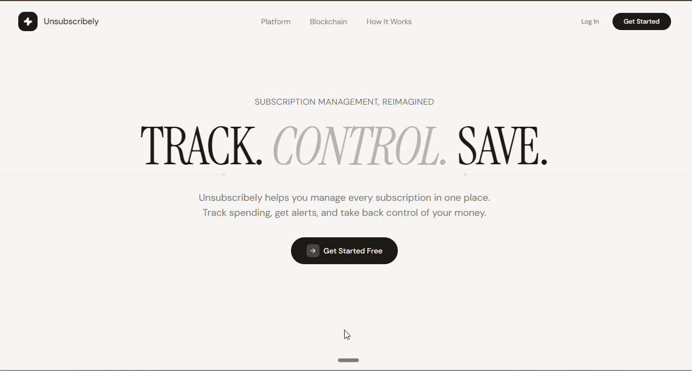
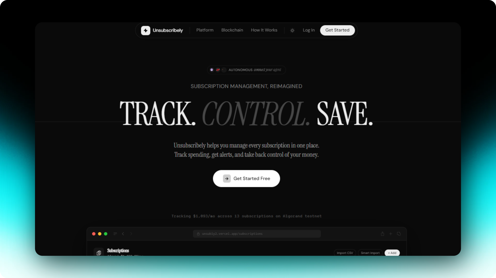
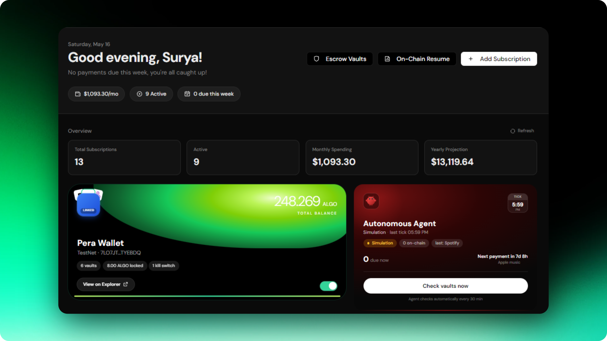
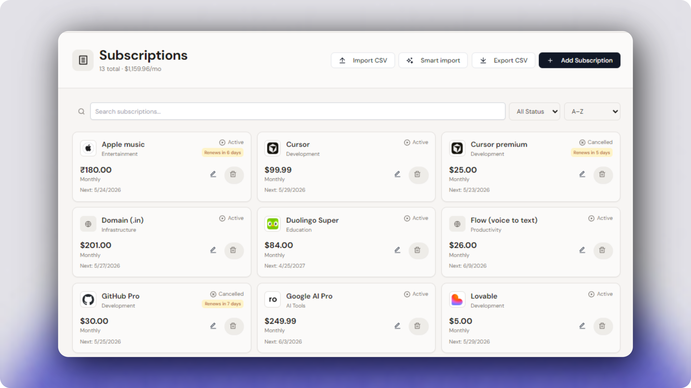
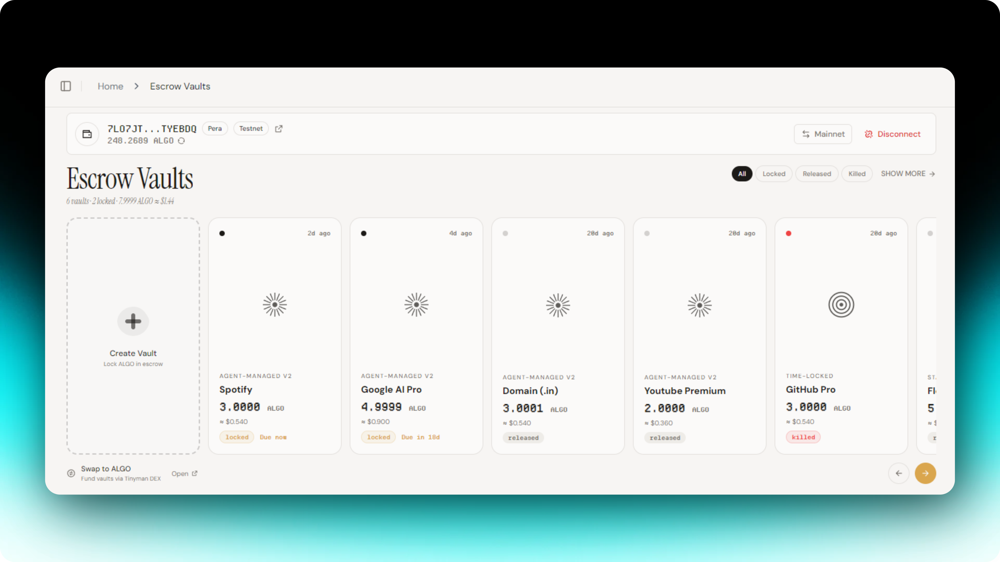
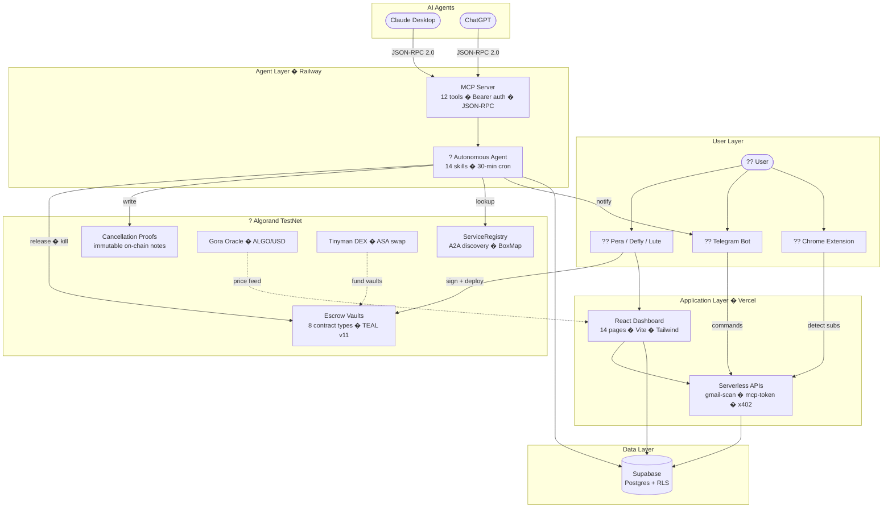

<!-- back to top anchor -->
<a id="readme-top"></a>

<!-- PROJECT LOGO -->
<div align="center">
  <a href="https://bliss.xyz">
    <picture>
      <source media="(prefers-color-scheme: dark)" srcset="screenshots/logo-dark.svg">
      
    </picture>
  </a>
  <h1>BLISS</h1>
  <p><em>Blockchain Layer for Identity & Subscription Shielding</em></p>
  
  <p>
    Lock ALGO in smart contract vaults you own. An autonomous agent releases payments on billing day.<br/>Every transaction is verifiable on Algorand.
  </p>

  <p align="center">
    <br />
    <a href="https://bliss.xyz"><strong>Explore the live app >></strong></a>
    <br />
    <br />
    <a href="https://youtu.be/0MkApCNN5p0"><kbd>View Demo</kbd></a>
    &middot;
    <a href="https://bliss.xyz/docs"><kbd>API Docs</kbd></a>
    &middot;
    <a href="https://github.com/devndesigner6/bliss/issues/new?labels=bug"><kbd>Report Bug</kbd></a>
    &middot;
    <a href="https://github.com/devndesigner6/bliss/issues/new?labels=enhancement"><kbd>Request Feature</kbd></a>
  </p>

  <p align="center">
    <a href="https://github.com/devndesigner6/bliss/graphs/contributors"></a>
    <a href="https://github.com/devndesigner6/bliss/network/members"></a>
    <a href="https://github.com/devndesigner6/bliss/stargazers"></a>
    <a href="https://github.com/devndesigner6/bliss/issues"></a>
    <a href="https://github.com/devndesigner6/bliss/blob/main/LICENSE"></a>
    <a href="https://linkedin.com/in/hemanthp15gr6"></a>
    <a href="https://x.com/hemanttbuilds"></a>
    <a href="https://t.me/blissybot"></a>
  </p>
</div>

<!-- TABLE OF CONTENTS -->
<details>
  <summary>Table of Contents</summary>
  <ol>
    <li><a href="#hackathon-track">Hackathon Track</a></li>
    <li>
      <a href="#about-the-project">About The Project</a>
      <ul>
        <li><a href="#built-with">Built With</a></li>
      </ul>
    </li>
    <li>
      <a href="#getting-started">Getting Started</a>
      <ul>
        <li><a href="#prerequisites">Prerequisites</a></li>
        <li><a href="#installation">Installation</a></li>
        <li><a href="#troubleshooting">Troubleshooting</a></li>
      </ul>
    </li>
    <li><a href="#usage">Usage</a></li>
    <li><a href="#how-it-works">How It Works</a></li>
    <li><a href="#business-model">Business Model</a></li>
    <li><a href="#roadmap">Roadmap</a></li>
    <li><a href="#contributing">Contributing</a></li>
    <li><a href="#license">License</a></li>
    <li><a href="#contact">Contact</a></li>
    <li><a href="#acknowledgments">Acknowledgments</a></li>
  </ol>
</details>

---

<!-- HACKATHON TRACK -->
## Hackathon Track

Built for **AlgoBharat Hack Series 3.0**, targeting the **Agentic Commerce** track, specifically the **A2A Autonomous Payments** and **A2A Agentic Commerce Framework** categories.

<p align="right">(<a href="#readme-top">back to top</a>)</p>

---

<!-- ABOUT THE PROJECT -->
## About The Project

<div align="center">
<table>
  <tr>
    <td align="center"><br/><sub><b>Landing Page</b></sub></td>
    <td align="center"><br/><sub><b>Dashboard</b></sub></td>
  </tr>
  <tr>
    <td align="center"><br/><sub><b>Subscriptions</b></sub></td>
    <td align="center"><br/><sub><b>Escrow Vaults</b></sub></td>
  </tr>
</table>
</div>

<br/>

Most subscription trackers are just spreadsheets with a nicer font. They show you what you spend, but they cannot do anything about it. BLISS puts your subscriptions on-chain. You lock funds in an escrow vault you own, an autonomous agent releases payments on billing day, and every transaction is verifiable on Algorand.

Here is why this is different:
* <kbd>Lock</kbd> funds in a smart contract vault  - your keys, your control, kill switch on everything
* <kbd>Agent</kbd> releases vaults on billing day <sub>every 30 min on Railway, no LLM needed</sub>
* <kbd>MCP</kbd> Server with 12 tools  - connect Claude, ChatGPT, or any AI to manage your subscriptions
* <kbd>Telegram</kbd> bot (@blissybot)  - cancel by voice/text, get alerts 3 days before renewal
* <kbd>Gmail</kbd> auto-import  - sign in with Google, we detect your subscriptions from receipts
* <kbd>Tinyman</kbd> DEX swap integration + <kbd>Gora</kbd> Oracle ALGO/USD price feeds
* <kbd>Proofs</kbd> on-chain cancellation proofs  - immutable evidence you cancelled

> [!NOTE]
> The average Indian developer pays for 8-12 SaaS tools in USD, losing 5-7% to forex markup per transaction. BLISS eliminates this with sub-penny on-chain settlement on Algorand.

### Deployed contracts <sup>Algorand TestNet</sup>

| Contract | App ID | Explorer |
|---|---|---|
| ServiceRegistry <sub>A2A discovery, 5 services seeded</sub> | <samp>759205676</samp> | [Lora](https://lora.algokit.io/testnet/application/759205676) |
| AgentEscrowVaultV2 template <sub>Box-storage billing history</sub> | <samp>759205677</samp> | [Lora](https://lora.algokit.io/testnet/application/759205677) |

Autonomous agent wallet: <samp>[RVHOYLPY4L47JYCYEMCP7EMEC2AZ3HV53YHSL2ZISX6PSO5EQ6H5YVAE5U](https://lora.algokit.io/testnet/account/RVHOYLPY4L47JYCYEMCP7EMEC2AZ3HV53YHSL2ZISX6PSO5EQ6H5YVAE5U)</samp>

Per-user vaults (Standard, AgentV2, Time-Lock, Multi-Sig, Dispute, ASA, Cancellation Insurance) are deployed on demand from the dashboard. MainNet singletons are not yet deployed. The app shows clear guards on mainnet for ServiceRegistry-dependent UIs.

> [!IMPORTANT]
> **Security:** Smart contracts are compiled with AlgoKit/PuyaPy and tested on TestNet. A formal third-party security audit is planned before any MainNet deployment with real user funds. All contracts are open source for community review.

### Architecture



<p align="right">(<a href="#readme-top">back to top</a>)</p>

### Built With

* [![TypeScript][TypeScript-shield]][TypeScript-url]
* [![React][React-shield]][React-url]
* [![Vite][Vite-shield]][Vite-url]
* [![TailwindCSS][Tailwind-shield]][Tailwind-url]
* [![Algorand][Algorand-shield]][Algorand-url]
* [![AlgoKit][AlgoKit-shield]][AlgoKit-url]
* [![Supabase][Supabase-shield]][Supabase-url]
* [![Cerebras][Cerebras-shield]][Cerebras-url]
* [![Railway][Railway-shield]][Railway-url]
* [![Vercel][Vercel-shield]][Vercel-url]

<p align="right">(<a href="#readme-top">back to top</a>)</p>

### Ecosystem Integrations

| Integration | Status | How it's used | Proof |
|---|---|---|---|
| **x402 Protocol** | ✅ Live | HTTP 402 payment gating on AI Optimizer | [x402-demo page](https://bliss.xyz/x402-demo) |
| **Pera SDK** | ✅ Live | Wallet connection, transaction signing, vault deployment | [Agent wallet txns](https://lora.algokit.io/testnet/account/RVHOYLPY4L47JYCYEMCP7EMEC2AZ3HV53YHSL2ZISX6PSO5EQ6H5YVAE5U) |
| **Tinyman SDK/Router** | ✅ Live | Swap any ASA → ALGO to fund vaults (deep-link + analytics API) | [Tinyman pool](https://testnet.tinyman.org/#/swap?asset_in=0) |
| **Gora Oracle** | ✅ Live | ALGO/USD price feed on vault cards (on-chain contract read + Vestige fallback) | App ID `159512493` |
| **NFDomains (DID)** | ✅ Live | .algo name resolution on dashboard wallet card | [nf.domains](https://nf.domains) |
| **Pera Connect** | ✅ Live | WalletConnect v2 for Pera/Defly/Lute mobile wallets | [Pera SDK](https://github.com/perawallet/connect) |
| **ServiceRegistry** | 🚀 Deployed | On-chain A2A service discovery (5 services seeded) | [App 759205676](https://lora.algokit.io/testnet/application/759205676) |
| **AgentEscrowVaultV2** | 🚀 Deployed | Box Storage billing history, autonomous release | [App 759205677](https://lora.algokit.io/testnet/application/759205677) |

---
## Getting Started

To get a local copy up and running, follow these steps.

> [!TIP]
> **The web app works fully without the agent running.** You can browse, add subscriptions, connect a wallet, and create vaults without any Railway or Telegram setup. The agent only adds autonomous vault releases.

### Prerequisites

* Node.js 20 or later
* A Supabase project. [Create a free one at supabase.com](https://supabase.com)
* Pera Wallet on Algorand Testnet. [Download Pera](https://perawallet.app), switch to Testnet in settings, then get free test ALGO from the [Algorand Testnet Faucet](https://bank.testnet.algorand.network/)
* Python 3.12 + AlgoKit - only needed if you want to recompile contracts (pre-compiled artifacts are already included)
  ```sh
  pip install algokit
  ```

> [!TIP]
> **No wallet?** The app is fully browsable without connecting Pera. You only need a wallet to deploy escrow vaults or sign transactions.

### Installation

1. Clone the repo
   ```sh
   git clone https://github.com/devndesigner6/bliss.git
   cd bliss
   ```
2. Install dependencies
   ```sh
   npm install
   ```
3. Set up environment variables
   ```sh
   cp .env.example .env
   ```
   Open `.env.example` first - every variable is documented with comments and a generation command. At minimum fill in:
   - `VITE_SUPABASE_URL` and `VITE_SUPABASE_PUBLISHABLE_KEY` from Supabase, Settings, API
   - `SUPABASE_SERVICE_ROLE_KEY` from Supabase, Settings, API (service_role key)
   - `CEREBRAS_API_KEY` from [cloud.cerebras.ai](https://cloud.cerebras.ai) - powers AI Chat page and Telegram bot
   - `AGENT_WALLET_MNEMONIC` and `VITE_AGENT_WALLET_ADDRESS` - generate with the one-liner in `.env.example`

4. Run the database schema (first time only)
   - Go to your Supabase project, SQL Editor
   - Paste the contents of `supabase/migrations/FULL_SCHEMA_SETUP.sql` and run it
   - This file exists at the root of the migrations folder and creates all tables, RLS policies, and indexes in one shot

5. Start the dev server
   ```sh
   npm run dev
   ```
   App runs at `http://localhost:5000`

   > **Mac users:** port 5000 conflicts with AirPlay Receiver. Either disable AirPlay (System Settings, AirDrop & Handoff) or change the port in `vite.config.ts` and `package.json` scripts to `5001`.

6. Run the test suite
   ```sh
   npx vitest run                          # frontend unit tests
   cd smart_contracts && pytest tests/      # smart contract tests
   ```
7. Production build and serve
   ```sh
   npm run build
   npm run start
   ```

<details open>
  <summary>Running the real OpenClaw agent locally</summary>

  The production agent is a real OpenClaw Gateway workspace, separate from the web app. OpenClaw owns the runtime and cron schedule; the existing BLISS vault code is exposed through the `bliss_vault_monitor` workspace skill.

  ```sh
  cd agents/openclaw
  npm install
  npm run start
  ```

  Create `agents/openclaw/.env` or export these values before starting:
  ```env
  AGENT_WALLET_MNEMONIC=your_25_word_mnemonic
  SUPABASE_URL=https://your-project-id.supabase.co
  SUPABASE_SERVICE_ROLE_KEY=your_service_role_key
  TELEGRAM_BOT_TOKEN=your_telegram_bot_token
  TELEGRAM_CHAT_ID=your_telegram_chat_id
  ALGO_NETWORK=testnet
  SERVICE_REGISTRY_APP_ID_TESTNET=759205676
  OPENCLAW_MODEL=google/gemini-2.0-flash
  OPENAI_API_KEY=your_model_provider_key
  ```

  `npm run start` writes an OpenClaw config, seeds a recurring OpenClaw cron job named `BLISS vault monitor`, and starts `openclaw gateway run`. The cron job runs every 30 minutes and tells OpenClaw to execute `npm run monitor:vaults` from this workspace.

  For a direct deterministic check without the Gateway, run:
  ```sh
  npm run monitor:vaults
  ```
</details>

<details open>
  <summary>Optional: recompile smart contracts or deploy to testnet</summary>

  Recompile contracts (pre-compiled artifacts are already included):
  ```sh
  algokit compile py smart_contracts/escrow/contract.py
  algokit compile py smart_contracts/agent_escrow/contract.py
  algokit compile py smart_contracts/agent_escrow_v2/contract.py
  algokit compile py smart_contracts/service_registry/contract.py
  algokit compile py smart_contracts/time_locked/contract.py
  algokit compile py smart_contracts/multi_sig/contract.py
  algokit compile py smart_contracts/dispute/contract.py
  algokit compile py smart_contracts/asa_escrow/contract.py
  ```

  Deploy singleton contracts (requires a funded testnet account):
  ```sh
  TESTNET_MNEMONIC="..." node scripts/deploy.js
  ```
</details>

<details open>
  <summary>Troubleshooting</summary>

  | Problem | Fix |
  |---|---|
  | Wallet not connecting | Make sure Pera Wallet is set to **Testnet** (Settings, Developer Settings, Node Configuration) |
  | "Recipient has not opted in" error | The recipient address must have received at least 1 ALGO before a vault can pay them. Send a small amount first from the faucet |
  | Agent wallet balance too low | Fund the agent wallet at [bank.testnet.algorand.network](https://bank.testnet.algorand.network/). It needs ALGO to pay transaction fees |
  | AI Chat returns error | Check that `CEREBRAS_API_KEY` is set in your `.env` and valid at [cloud.cerebras.ai](https://cloud.cerebras.ai) |
  | Supabase RLS errors | Make sure you ran `FULL_SCHEMA_SETUP.sql` in the SQL Editor. Missing tables cause silent 403s |
  | x402 payment rejected | Ensure `X402_PAY_TO_ADDRESS` matches `VITE_AGENT_WALLET_ADDRESS` or leave both blank to disable x402 in dev |

</details>

<p align="right">(<a href="#readme-top">back to top</a>)</p>

---

<!-- HOW IT WORKS -->
## How It Works

**1. <kbd>Lock</kbd>**  - Add a subscription and deploy an escrow vault from the dashboard. Choose from 7 vault types: <samp>Standard</samp>, <samp>AgentV2</samp>, <samp>Time-Lock</samp>, <samp>Multi-Sig</samp>, <samp>Dispute</samp>, <samp>ASA</samp>, or <samp>Cancellation Insurance</samp>. Your ALGO sits in a contract you own.

**2. <kbd>Release</kbd>**  - OpenClaw checks every 30 minutes. When a billing date hits, it verifies the recipient against the on-chain ServiceRegistry, checks your spending guardrails, and calls <samp>release()</samp> on the contract. Funds go directly on-chain. You get a Telegram notification with the transaction ID.

**3. <kbd>Prove</kbd>**  - Mint an ARC-3 NFT receipt after each release. AgentEscrowVaultV2 also writes an immutable <samp>BillingRecord</samp> into Box Storage per cycle, giving you a full on-chain billing history.

<p align="right">(<a href="#readme-top">back to top</a>)</p>

---

<!-- USAGE -->
## Usage

1. Sign up at [bliss.xyz](https://bliss.xyz)  - free, no credit card.
2. Add subscriptions manually, import CSV, or sign in with Google for auto-detection.
3. Connect Pera/Defly wallet ? create an escrow vault ? fund it with ALGO.
4. Connect Telegram (@blissybot) in Settings for renewal alerts and voice commands.
5. The agent runs every 30 min  - releases vaults on billing day, notifies you via Telegram.
6. To cancel: say "cancel spotify" in Telegram, follow instructions, reply "done"  - vault killed, ALGO returned.
7. Connect your AI agent (Claude/ChatGPT) from the Connect Agent page to manage subscriptions via MCP.

<p align="right">(<a href="#readme-top">back to top</a>)</p>

---

<!-- BUSINESS MODEL -->
## Business Model

<kbd>Phase 1</kbd> <sub>current</sub>  - Free for users. Revenue from x402 micro-payments: external AI agents pay 0.001 ALGO per API call to access subscription data. No API keys, no subscriptions needed. Payment IS the credential.

<kbd>Phase 2</kbd> <sub>post-audit</sub>  - Mainnet launch. Premium MCP access ($5/mo for write+admin scope). ServiceRegistry listing fee (one-time ALGO payment for service providers to publish).

<kbd>Phase 3</kbd>  - B2B vault infrastructure. Companies use escrow contracts for employee subscription procurement. Agent handles vendor payments autonomously.

**Target users:** Indian developers and freelancers (25-35) managing 8-12 SaaS tools (Notion, GitHub, Cursor, Figma) totaling $50-150/month in USD, losing 5-7% to forex fees per transaction.

**Why Algorand:** <samp>3.3s finality</samp> � <samp>sub-penny fees</samp> � ARC-4 ABI for clean contract interfaces � Box Storage for on-chain history � instant settlement without L2 complexity.

<p align="right">(<a href="#readme-top">back to top</a>)</p>

---

<!-- ROADMAP -->
## Roadmap

- [x] Seven escrow vault types: Standard, AgentV2, Time-Lock, Multi-Sig, Dispute, ASA, Cancellation Insurance
- [x] Autonomous agent on Railway (runs every 30 min, no LLM needed for core ops)
- [x] Telegram bot (@blissybot)  - voice messages, AI intent classification, cancel/keep/done commands
- [x] Gmail auto-import  - detects subscriptions from 6 months of email receipts
- [x] MCP Server  - 12 tools, Bearer auth, rate limiting, connects Claude/ChatGPT/any MCP client
- [x] Trial-to-paid human-in-the-loop Telegram confirmation before agent releases
- [x] Spending guardrails: monthly budget cap, blackout dates, per-subscription limits
- [x] Algorand-flavoured x402 payment middleware (HTTP 402 + on-chain settlement)
- [x] On-chain ServiceRegistry for A2A service discovery (5 services seeded on TestNet)
- [x] AgentEscrowVaultV2 with Box Storage for immutable on-chain billing history
- [x] AI Chat powered by Cerebras (gpt-oss-120b) with full subscription context
- [x] Telegram AI chatbot with natural language subscription management
- [x] On-chain cancellation proofs (zero-ALGO self-transfer with structured JSON note)
- [x] Tinyman DEX integration for ASA ? ALGO swaps
- [x] Gora Oracle price feeds (ALGO/USD) on vault cards
- [x] NFD (.algo) name resolution on dashboard
- [x] DB-backed idempotency locks (prevents double-release across multiple agent instances)
- [x] Connect Agent page  - one-click token generation for Claude Desktop / ChatGPT
- [ ] MainNet deployment of ServiceRegistry and AgentEscrowVaultV2 singletons
- [ ] Smart contract security audit by reputable third party before MainNet launch
- [ ] Contract upgradeability strategy (proxy pattern or governance-based upgrades)
- [ ] Mobile app using Expo with Pera Wallet deep-link support
- [ ] Multi-currency ASA support (USDC, USDt on Algorand)

<p align="right">(<a href="#readme-top">back to top</a>)</p>

---

<!-- CONTRIBUTING -->
## Contributing

Contributions welcome. Fork ? branch ? commit ? PR. Run `npm test` before submitting.

**Code style:** TypeScript strict, Tailwind CSS, ESLint defaults.

<p align="right">(<a href="#readme-top">back to top</a>)</p>

---

<!-- LICENSE -->
## License

Apache 2.0  - see [`LICENSE`](LICENSE).

---

## Contact

Hemanth Peddada  - [@hemanttbuilds](https://x.com/hemanttbuilds) � [peddadahemanth6@gmail.com](mailto:peddadahemanth6@gmail.com) � [hemanthme.in](https://hemanthme.in)

---

<!-- ACKNOWLEDGMENTS -->
## Acknowledgments

* [Algorand Foundation](https://algorand.foundation) � [AlgoKit](https://github.com/algorandfoundation/algokit-cli) � [Pera Wallet](https://perawallet.app)
* [x402 Protocol](https://x402.org) � [OpenClaw](https://openclaw.im) � [Model Context Protocol](https://modelcontextprotocol.io)
* [Tinyman DEX](https://tinyman.org) � [Gora Oracle](https://gora.io) � [NFDomains](https://nf.domains)
* [Supabase](https://supabase.com) � [Railway](https://railway.app) � [Vercel](https://vercel.com)
* [Cerebras](https://cerebras.ai) � [Telegram Bot API](https://core.telegram.org/bots)
* [shadcn/ui](https://ui.shadcn.com) � [Remix Icons](https://remixicon.com) � [Vitest](https://vitest.dev)

<p align="right">(<a href="#readme-top">back to top</a>)</p>

<!-- MARKDOWN LINKS & IMAGES -->
[TypeScript-shield]: https://img.shields.io/badge/TypeScript-3178C6?style=for-the-badge&logo=typescript&logoColor=white
[TypeScript-url]: https://www.typescriptlang.org
[React-shield]: https://img.shields.io/badge/React-20232A?style=for-the-badge&logo=react&logoColor=61DAFB
[React-url]: https://react.dev
[Vite-shield]: https://img.shields.io/badge/Vite-646CFF?style=for-the-badge&logo=vite&logoColor=white
[Vite-url]: https://vite.dev
[Tailwind-shield]: https://img.shields.io/badge/TailwindCSS-06B6D4?style=for-the-badge&logo=tailwindcss&logoColor=white
[Tailwind-url]: https://tailwindcss.com
[Algorand-shield]: https://img.shields.io/badge/Algorand-000000?style=for-the-badge&logo=algorand&logoColor=white
[Algorand-url]: https://algorand.com
[AlgoKit-shield]: https://img.shields.io/badge/AlgoKit-v2-00A97F?style=for-the-badge&logo=algorand&logoColor=white
[AlgoKit-url]: https://github.com/algorandfoundation/algokit-cli
[Supabase-shield]: https://img.shields.io/badge/Supabase-3ECF8E?style=for-the-badge&logo=supabase&logoColor=white
[Supabase-url]: https://supabase.com
[Cerebras-shield]: https://img.shields.io/badge/Cerebras-000000?style=for-the-badge&logo=cerebras&logoColor=white
[Cerebras-url]: https://cerebras.ai
[Railway-shield]: https://img.shields.io/badge/Railway-0B0D0E?style=for-the-badge&logo=railway&logoColor=white
[Railway-url]: https://railway.app
[Vercel-shield]: https://img.shields.io/badge/Vercel-000000?style=for-the-badge&logo=vercel&logoColor=white
[Vercel-url]: https://bliss.xyz
